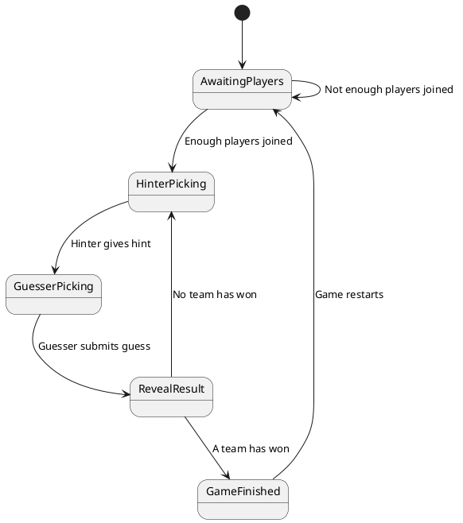

# MindsterGames

## TODO

- [ ] Reconnect based on csrf token
- [ ] Leave game
- [ ] Pick name (just csrf token for now)
- [ ] Create Room and pick game
- [ ] Allow different game types

## Development
To start your Phoenix server:

  * Run `mix setup` to install and setup dependencies
  * Start Phoenix endpoint with `mix phx.server` or inside IEx with `iex -S mix phx.server`

Now you can visit [`localhost:4000`](http://localhost:4000) from your browser.

Ready to run in production? Please [check our deployment guides](https://hexdocs.pm/phoenix/deployment.html).

## Game types

### Potentiometer Game

Based on the board game Wavelength

_[View in PlantText](https://www.planttext.com/)_

